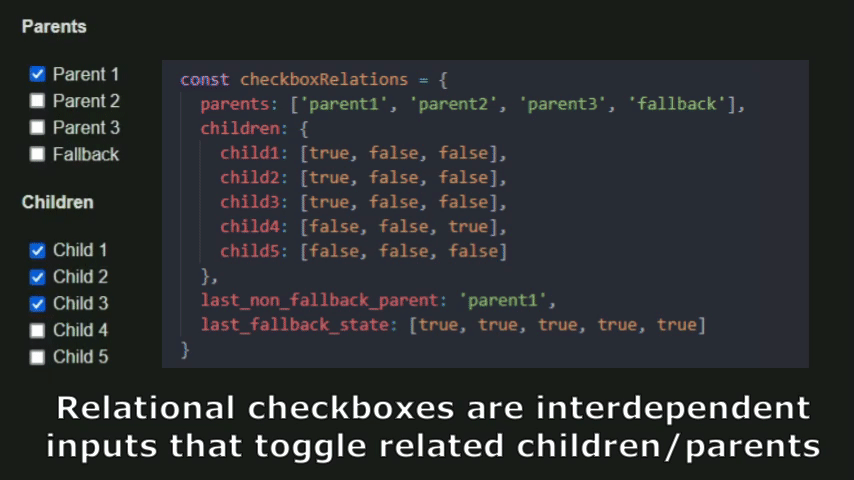

# Checkbox Relations

### Quick Description

Relational checkboxes are interdependent inputs that automatically toggle related children and parents on or off.

### Visual Demonstration



### Detailed Description

This script and the corresponding data structure allows one to set up relationships between any number of checkboxes on an HTML page. When a parent checkbox is toggled by a website user, the child checkboxes will also be toggled on or off, depending on the state the parent requires them to be in. Similarly, when a child checkbox is toggled by a user, the corresponding parent checkboxes may also be toggled on or off.

The website will remember the user's last choice and load it on the next visit. The last state of the fallback parent is also saved between browser sessions. This is assuming the user has local storage turned on in their browser (this is on by default on most systems). 

### How It Works and Usage

The best way to understand how the script works is to see it in action. In order to do that, clone the repository or download the files to your system, and open up `index.html` in a browser. Start toggling the various checkboxes a few times to see how they behave. You should be able to predict their behavior from the `data.js` file. The checkbox inputs are implemented and laid out in the HTML file, but their relational behavior and persistence are programmed within `main.js`. The `demo.js` file merely imports the two other javascript files as modules and calls the main function with the data as an argument.

To adapt this script for your own purposes, you should only have to create or edit your own HTML file by adding the required input boxes, and define a new data structure to reflect your own desired checkbox relations. You should not have to modify `main.js`. You will however have to import it as a module into your own javascript file and call the function within it with your own data file as an argument. 

Our demo setup consists of nine checkboxes in total: four parents (`parent1`, `parent2`, `parent3`, and `fallback`) and five children (`child1` to `child5`).

The HTML code for one of the input checkboxes used in the demo is provided below. The important thing to note here is the `id` attribute `parent1`, which is also used in the data structure.

```
<input type="checkbox" id="parent1">
```

Our demo data structure looks as follows.

```
const checkboxRelations = {
  parents: ['parent1', 'parent2', 'parent3', 'fallback'],
  children: {
    child1: [true, false, false],
    child2: [true, false, false],
    child3: [true, false, false],
    child4: [false, false, true],
    child5: [false, false, false]
  },
  last_non_fallback_parent: 'parent1',
  last_fallback_state: [true, true, true, true, true]
}
```

Again, note that the identifiers used in the data structure match the ID attributes used for the HTML checkboxes. Also note that the child identifiers are not surrounded by quotes in our case, but the quotes may be required depending on what identifiers you use (e.g. identifiers with dashes such as `child-one`).

Each child consists of an array of boolean values (true/false). The length of each child array is one less than the length of the parents array, i.e. the number of "normal" parents (total parents minus the fallback parent). Each boolean value represents the checked state of the child checkbox that the parent of the same index in the `parents` array needs it to be in. So when `parent3` (which is at index 2 in the `parents` array) is manually toggled on, the script looks at all the children's boolean values at index 2 and automatically toggles `child1`, `child2`, `child3`, and `child4` off since they are `false`, while `child4` is toggled on since it is `true`.

The `fallback` parent is a special parent that is toggled when the children are in an undefined state. So if, for example, the first two children are toggled on, and the last three children are toggled off, then `fallback` will also be toggled on, because `data.js` contains no parent that was defined to corresponds to that particular set of child states.

The `last_non_fallback_parent` and `last_fallback_state` are merely used for initialization on the first visit. You may specify different values for these two objects if you'd like, but they will become irrelevant after the first visit, since subsequent sessions will load the previous user-selected state from local storage.

### Projects Using This Module

https://wordluxe.io/ (the game settings are relational checkboxes styled as toggles).

### Usage License

All content in this repository is copyright 2023 by Chris. You are welcome to use/modify every part of this repository's content provided you grant me  attribution in an accessible location within your own work where such information might usually be found (perhaps a credits or info section). The note should include a link to this repository. Below is an example of what such an attribution might look like.

> The checkbox relations module is free and open-source software originally created by Chris. The original module is available at https://github.com/chriskorosu/checkbox_relations.

I would also appreciate a note letting me know where and how this is being used, but it's not necessary. My contact information is available on my [Github profile](https://github.com/chriskorosu/).